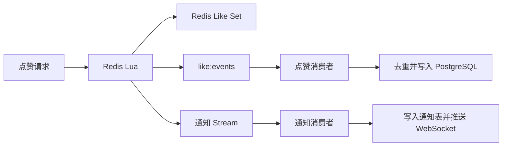

# Holocron Blog

一个基于 FastAPI 与 Vue 3 的内容论坛项目，包含文章、评论、点赞、通知、分类、标签和后台管理功能。项目重点不在功能堆叠，而在于通过压测定位高并发链路瓶颈，并围绕 PostgreSQL、Redis Lua、Redis Stream、限流和缓存一致性进行针对性优化。

## 技术栈

- 后端：FastAPI、SQLAlchemy 2.0 Async、Pydantic v2
- 数据库：PostgreSQL、Alembic
- 缓存与消息：Redis、Redis Lua、Redis Stream
- 认证与通信：JWT、权限控制、WebSocket
- 前端：Vue 3、Vue Router、Vite、Axios
- 测试与压测：pytest、pytest-asyncio、wrk

## 核心设计

### 1. 点赞高并发链路

早期测试中，点赞接口受到 SQLite 并发写入能力和请求链路同步处理的限制，RPS 下降且 p99 延迟明显升高。针对瓶颈进行了两步改造：

- 将数据库迁移至 PostgreSQL，改善并发读写能力；
- 使用 Redis Lua 在一次 `EVAL` 中完成点赞集合状态变更、当前计数读取和 Stream 事件写入；
- 将点赞持久化和通知写库移出请求链路，改为后台消费者异步处理。

点赞请求的核心流程如下：



### 2. Stream 异步持久化与异常处理

点赞事件使用 Redis Stream Consumer Group 处理。消费者按批次读取消息，并以 `user_id + target_type + target_id` 为键保留同一目标的最新状态，再写入 PostgreSQL，减少重复操作。

可靠性处理包括：

- 数据库提交成功后再 `XACK`，避免消息确认早于持久化；
- 认领超时的 Pending 消息并重新消费；
- 超过重试次数的点赞事件转移到死信 Stream；
- 通过后台对账检查 Redis Set、点赞明细和冗余计数字段之间的延迟。

通知 Stream 同样采用异步消费者，负责通知入库和 WebSocket 推送。它的失败消息保留在 Pending 中等待后续认领，不与点赞事件共用死信逻辑。

### 3. Redis 高并发限流

限流中间件组合使用两种策略：

- **Token Bucket**：允许有限突发流量，并按固定速率补充令牌；
- **ZSet Sliding Window**：记录请求时间戳，限制滑动窗口内的持续请求量。

两种策略均通过 Redis Lua 将读取、判断、计数更新和过期时间设置合并为原子操作。系统支持按接口配置容量、补充速率和窗口请求数；连续违规请求会进入递进式惩罚，达到阈值后临时封禁。Redis 异常时采用 fail-open，优先保证业务可用性，但故障期间限流保护会暂时失效。

### 4. 缓存治理

文章详情采用 Cache-Aside，结合空值缓存、随机 TTL 和 `SET NX EX` 互斥重建，处理缓存穿透、雪崩和击穿；同时支持主动失效、后台重建及 Redis 故障回退数据库。点赞状态使用 Redis Set 保存实时状态，并通过定时对账修复 PostgreSQL 中的冗余计数。

## 性能结果

以下数据来自相同的 `wrk` 测试条件（4 threads、50 connections、35s、`--latency`），用于对比改造前后的代表性结果：

| 场景 | RPS | p99 |
|---|---:|---:|
| SQLite，一次 SQL | 1,033.96 | 135.71 ms |
| PostgreSQL，一次 SQL | 2,976.68 | 65.91 ms |
| PostgreSQL，同步通知 toggle | 1,153.84 | 129.48 ms |
| PostgreSQL，异步通知 toggle | 1,924.31 | 55.90 ms |

结果表明：

- PostgreSQL 一次 SQL 场景 RPS 提升约 **2.88 倍**，p99 降低约 **51%**；
- 通知异步化后，toggle 场景 RPS 提升约 **66.7%**，p99 降低约 **56.8%**；
- 在 200～300 并发附近，点赞链路吞吐达到约 2,100～2,300 RPS；继续提高并发后吞吐趋于平台期，延迟继续上升。

完整测试过程、测试条件和原始结果见 [`scripts/bench.md`](scripts/bench.md)。

## 项目结构

```text
app/
├── routers/       # API 路由
├── services/      # 业务逻辑、点赞与缓存
├── models/        # SQLAlchemy 模型
├── schemas/       # Pydantic 数据模型
├── core/          # 数据库、Redis、Stream、WebSocket、认证
└── middleware/    # 限流中间件
frontend/src/      # Vue 前端
test/              # API、服务、核心模块和中间件测试
scripts/           # Stream、迁移和压测脚本
alembic/versions/  # 数据库迁移
```

## 最小运行说明

项目依赖 PostgreSQL 和 Redis，数据库连接使用 `postgresql+asyncpg://`。配置 `.env` 后执行：

```bash
pip install -r requirements.txt
alembic upgrade head
uvicorn app.main:app --host 127.0.0.1 --port 8848
```

测试与构建：

```bash
pytest
cd frontend && npm run build
```

API 文档：`/docs`。压测脚本位于 `scripts/bench_wrk.sh` 和 `scripts/bench_like.lua`。
